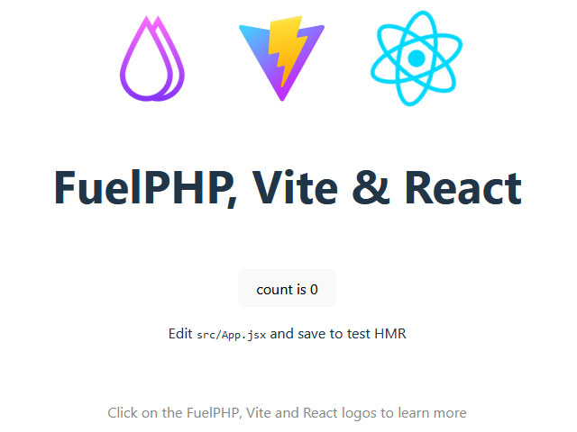

# FuelPHP Vite Module Documentation

> Use the Vite build tool with FuelPHP to provide a faster and leaner development experience for modern web projects.

If you are not familiar with Vite, please see the [Vite website](https://vitejs.dev/guide/) for more information.

This is a basic starter kit, allowing the use of React modules in FuelPHP projects, it can easily be tailored to support [Vue](https://vuejs.org/), [Svelte](https://svelte.dev/) etc. if required.

## Installation

If it is not already present, add the `composer.anstech.co.uk` repository to your composer.json file:

```json
...
"repositories": [{
  "type": "composer",
  "url": "https://composer.anstech.co.uk/"
}],
...
```

Use composer to add the Vite dependency to your project:

```console
cd {FuelPHP directory}
composer require fuel/vite
```

Install the Vite dependencies, using your preferred JavaScript package management tool (e.g. yarn, npm):

```console
cd {FuelPHP packages directory}\vite
yarn install
```

Depending how frequently you intend to use Vite, the FuelPHP package may either be manually loaded in your PHP code:

```php
Package::load('vite`);
```

Or added to relevant `always_load` section of the FuelPHP configuration file.

```php
...
'always_load' => array(
    'packages' => array(
		'vite',
    ),
),
...
```

## Development

Open a console window and navigate to the FuelPHP Vite package directory and start the Vite `dev` server:

```console
cd {FuelPHP packages directory}\vite
yarn dev
```

## Usage

In this example, the React entry point `main.jsx` tries to inject itself into any tag with the `react-example` class.  As such, the following example view should display the module in your application:

```php
<!DOCTYPE html>
<html lang="en">
    <head>
        <meta charset="UTF-8">
        <meta name="viewport" content="width=device-width, initial-scale=1.0">
        <title>Vite App</title>
        <?php
            echo Vite::forge('main.jsx');
        ?>
    </head>
    <body>
        <div class="react-example"></div>
    </body>
</html>
```

Browser view:



Changing any of the code in `src` directory should automatically update the browser, using HMR (Hot Module Replacement).  In addition, changes to PHP files in either the FuelPHP `app` or `public` directories should also trigger a page refresh, due to the [vite-plugin-live-reload](https://www.npmjs.com/package/vite-plugin-live-reload) plugin.

## Deployment

Open a console window and navigate to the FuelPHP Vite package directory and `build` the assets:

```console
cd {FuelPHP packages directory}\vite
yarn build
```

Vite will build/compile the assets into the `dist` folder of the FuelPHP `public` directory.  Whenever the Vite development server is *not* running these assets will be used by the application.
